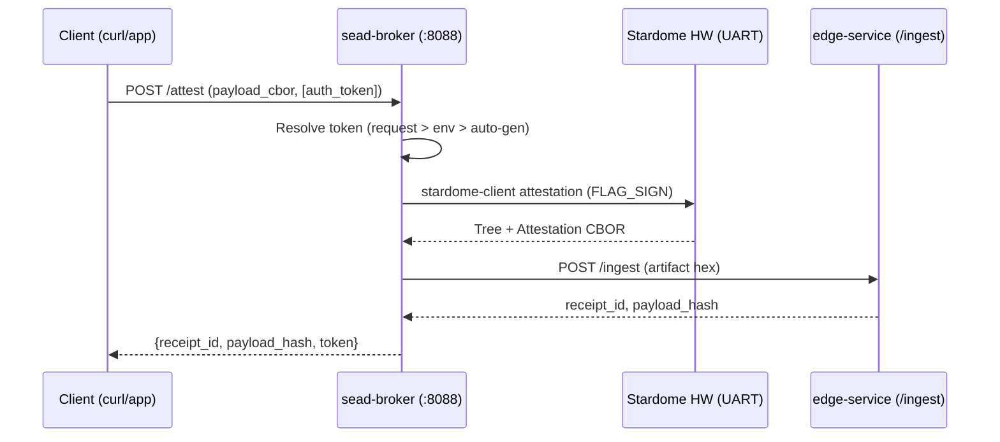
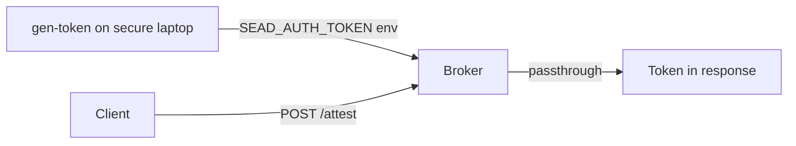
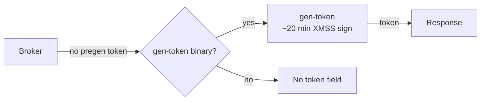

# Stardome SEAD Broker

**Hardware attestation broker for Stardome SEAD.** Wraps the `stardome-client`
binary to perform XMSS attestation signing via Stardome hardware over UART,
submits signed artifacts to the SEAD edge-service `/ingest` API, and resolves
auth tokens for downstream consumers (e.g. IPFS pinning).

Acts as a bridge between the physical Stardome hardware module and the SEAD
service mesh — no firmware changes needed.

## Architecture



### Token flow (pre-generated — recommended)



### Token flow (auto-generation — development only)



## Deploy

### Prerequisites

- Docker + Docker Compose plugin
- Stardome hardware module connected via UART
- A running SEAD edge-service (local or remote)
- The `sead-network` Docker network:
  ```bash
  docker network create sead-network 2>/dev/null || true
  ```

### Quick start

```bash
# 1. Edit .env with your configuration (see reference below)
#    At minimum: SEAD_EDGE_URL, EDGE_MODULE_ID, EDGE_ID, EDGE_ORG_ID

# 2. Pull and run
docker compose -f docker-compose.remote.yml pull
docker compose -f docker-compose.remote.yml up -d

# 3. Verify
curl http://localhost:8088/health
```

### Finding the serial device

```bash
# List USB serial devices
ls -la /dev/ttyUSB*
# Or check dmesg for the correct device
dmesg | grep ttyUSB
```

Update `STARDOME_PORT` in `.env` to match your device (default: `/dev/ttyUSB0`).

### Edge service address

The `SEAD_EDGE_URL` can point to:
- A local container: `http://edge-service:8081` (on `sead-network`)
- A remote POC node: `http://192.168.0.102:8081`
- Any reachable SEAD edge-service

## Configuration

Create a `.env` file (copy from `.env` in this repo):

| Variable | Required | Default | Description |
|----------|----------|---------|-------------|
| `STARDOME_CLIENT_PATH` | No | `/opt/stardome/bin/stardome-client` | Path to stardome-client binary |
| `STARDOME_PORT` | No | `/dev/ttyUSB0` | Serial device for hardware |
| `STARDOME_BAUD` | No | `115200` | UART baud rate |
| `STARDOME_TIMEOUT_MS` | No | `60000` | Hardware signing timeout (ms) |
| `STARDOME_SCHEME` | No | `v1.0.0_0` | CBOR scheme version |
| `SEAD_EDGE_URL` | **Yes** | — | Edge-service ingest endpoint |
| `SEAD_INGEST_TIMEOUT_SEC` | No | `30` | SEAD ingest timeout (s) |
| `EDGE_MODULE_ID` | **Yes** | — | Module ID (hex) |
| `EDGE_ID` | **Yes** | — | Edge device ID (hex) |
| `EDGE_ORG_ID` | **Yes** | — | Organization ID (hex) |
| `SEAD_AUTH_TOKEN` | No | — | Pre-generated token (recommended) |
| `GEN_TOKEN_PATH` | No | — | gen-token binary path (dev only) |
| `EDGE_ORG_SIGNING_KEY` | No | — | Org XMSS signing key |
| `EDGE_ORG_PUBLIC_KEY` | No | — | Org XMSS public key |
| `EDGE_TOKEN_TTL` | No | `300` | Token TTL (s) |
| `GEN_TOKEN_TIMEOUT_SEC` | No | `1800` | Auto-generation timeout (s) |

### Token modes

| Mode | Setup | Latency | Use case |
|------|-------|---------|----------|
| **Pre-generated** (recommended) | Set `SEAD_AUTH_TOKEN` | Zero | Production — generate on secure laptop |
| **Auto-generation** | Set `GEN_TOKEN_PATH` + org keys | ~20 min | Development/debug only |
| **None** | Neither configured | N/A | Attestation without pinning |

## API Endpoints

| Method | Path | Description |
|--------|------|-------------|
| `POST` | `/attest` | Full attestation flow (sign + ingest + token resolve) |
| `GET` | `/health` | Broker and dependency health status |
| `GET` | `/status` | Hardware module state |

### POST /attest

Request body:

```json
{
  "payload_cbor": "/path/to/payload.cbor",
  "auth_token": "optional-per-request-token"
}
```

- `payload_cbor` (optional, string): Path to a pre-built CBOR attestation payload.
  Defaults to a minimal payload if omitted.
- `payload_file` (optional, string): Path to a raw file — the broker builds a
  single-source CBOR payload automatically. Mutually exclusive with `payload_cbor`.
- `auth_token` (optional, string): Per-request auth token. Takes precedence over
  the `SEAD_AUTH_TOKEN` environment variable.

Response (200):

```json
{
  "receipt_id": "2da1d5f1a226cfb899b61b31a55a7385ed8ff80d60bbc62ae35e85d10e3b522c",
  "status": "accepted",
  "payload_hash": "3d62c6d756bf57641c277069b6371ae8039930747cc5752fd53e4ff4a765f901",
  "token": "base64url_token_or_null"
}
```

#### curl examples

**With pre-generated token (env var):**
```bash
curl -X POST http://localhost:8088/attest \
  -H "Content-Type: application/json" \
  -d '{"payload_cbor": "/data/payload.cbor"}'
```

**With per-request token (overrides env):**
```bash
curl -X POST http://localhost:8088/attest \
  -H "Content-Type: application/json" \
  -d '{
    "payload_cbor": "/data/payload.cbor",
    "auth_token": "my_request_token"
  }'
```

**Without any token (field omitted in response):**
```bash
curl -X POST http://localhost:8088/attest \
  -H "Content-Type: application/json" \
  -d '{"payload_cbor": "/data/payload.cbor"}'
```

### GET /health

```bash
curl http://localhost:8088/health
```

Response:
```json
{
  "status": "healthy",
  "dependencies": {
    "stardome_client": {"status": "ok"},
    "sead_edge": {"status": "ok"},
    "gen_token": {"status": "not_configured", "detail": "..."},
    "token_mode": {"status": "pre-generated"}
  }
}
```

### GET /status

```bash
curl http://localhost:8088/status
```

Response:
```json
{
  "hardware": "connected",
  "state": "idle"
}
```

## Integrator Guidance

The broker is designed as a **reference pattern** for integrating Stardome XMSS
hardware with SEAD services. Key customization points:

1. **stardome-client path**: Override via `STARDOME_CLIENT_PATH` or volume-mount
   a custom binary with different command semantics.
2. **Payload selection**: The `payload_cbor` / `payload_file` fields let you
   control what the hardware signs — adapt to your specific payload format.
3. **Token strategy**: Pre-generated tokens are the production path. Auto-generation
   using `gen-token` is provided for development environments where the XMSS
   signing key is accessible on the same machine.

## Demo Flow

1. **Key generation**: Use the `keygen` Docker image (see
   [stardome-sead](https://github.com/Stardome-technology/stardome-sead))
2. **Bootstrap**: Register org + authorize edge via `gen-bootstrap`
3. **Pre-generate token**: Use `gen-token` on the secure laptop:
   ```bash
   docker run --rm -v "$(pwd):/data" \
     ghcr.io/stardome-technology/stardome-sead/gen-token \
     --org-id <org_id_hex> \
     --org-signing-key <org_secret_key_hex> \
     --org-public-key <org_public_key_hex> \
     --payload-file /data/endorse_att.bin \
     --out-file /data/token.b64
   ```
4. **Set `SEAD_AUTH_TOKEN`** in `.env` to the generated token
5. **Run the broker** and call `POST /attest`

## Related Repositories

- [stardome-sead](https://github.com/Stardome-technology/stardome-sead) — full SEAD service stack
- [stardome-client](https://github.com/Stardome-technology/stardome-client) — hardware communication client
- [stardome-sead-explorer](https://github.com/Stardome-technology/stardome-sead-explorer) — operational dashboard
- [stardome-sead-p2p](https://github.com/Stardome-technology/stardome-sead-p2p) — P2P discovery sidecar
- [stardome-cbor-schemes](https://github.com/Stardome-technology/stardome-cbor-schemes) — CBOR schema definitions