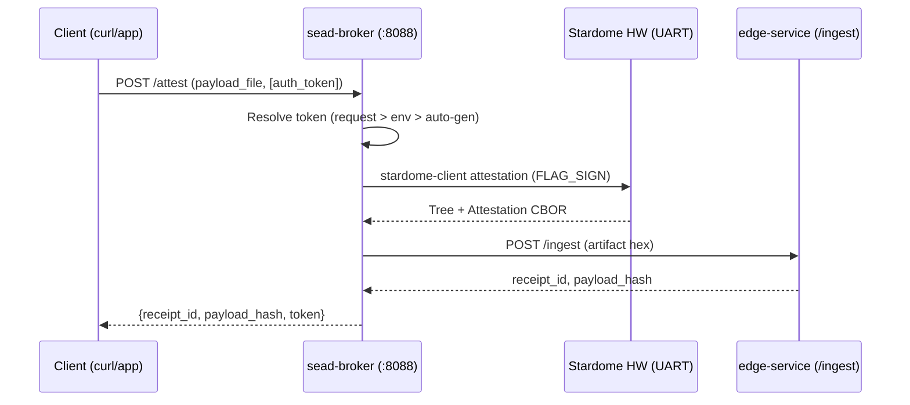
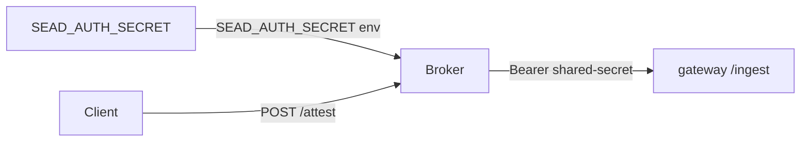
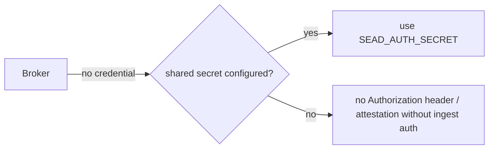

# Stardome SEAD Broker

**Hardware attestation broker for Stardome SEAD.** Wraps the `stardome-client`
binary to perform XMSS attestation signing via Stardome hardware over UART,
submits signed artifacts to the SEAD edge-service `/ingest` API, and resolves
auth tokens for downstream consumers (e.g. IPFS pinning).

Acts as a bridge between the physical Stardome hardware module and the SEAD
service mesh — no firmware changes needed.

## Architecture



### Auth flow (shared secret — recommended)

The broker authenticates `/ingest` to the gateway with a **shared secret**
(the stack's `SEAD_AUTH_SECRET`), passed through as a bearer header.



### Auth flow (auto-generation — development only)



## Deploy

### Prerequisites

- Docker + Docker Compose plugin
- Stardome hardware module connected via UART
- A running SEAD edge-service (local or remote)
- The `sead-network` Docker network:
  ```bash
  docker network create sead-network 2>/dev/null || true
  ```

### Quick start

```bash
# 1. Edit .env with your configuration (see reference below)
#    At minimum: SEAD_EDGE_URL, EDGE_MODULE_ID, EDGE_ID, EDGE_ORG_ID

# 2. Pull and run
docker compose -f docker-compose.remote.yml pull
docker compose -f docker-compose.remote.yml up -d

# 3. Verify
curl http://localhost:8088/health

## Public ports to open

For an integrator deploying the broker, only one port needs to be reachable
from clients:

- **`8088/tcp`** — broker HTTP API (`/attest`, `/health`, `/status`)

This is the only public port. The broker reaches the SEAD edge-service and the
Stardome hardware over UART internally; no other ports need to be exposed. If
clients are on the same host or Docker network, `8088` can stay closed to the
internet as well.
```

### Finding the serial device

```bash
# List USB serial devices
ls -la /dev/ttyUSB*
# Or check dmesg for the correct device
dmesg | grep ttyUSB
```

Update `STARDOME_PORT` in `.env` to match your device (default: `/dev/ttyUSB0`).

### Edge service address

The `SEAD_EDGE_URL` can point to:
- The gateway on the same host: `https://<node-lan-ip>:30080` (e.g. `https://192.168.0.102:30080`)
- A remote gateway: `https://<IP>:30080`
- Any reachable SEAD gateway (TLS)

> **Hostname matters for TLS.** The gateway is TLS-only. Set `SEAD_EDGE_URL` to the
> node's **LAN IP** (which is in the gateway cert's SAN). Do **not** use
> `host.docker.internal` — with `SEAD_CA_CERT` verification the cert is not valid
> for that hostname.

### Trusting a gateway's TLS cert (closed deployments only)

If the broker calls a SEAD gateway over `https://<node>:30080/...` that presents a
certificate signed by a **private/self-signed CA** (see the SEAD/gateway setup), the
broker must trust that CA. This is only appropriate in **closed, single-operator
deployments**  where every client is under your control.

- Distribute **only `ca.crt`** to clients as the trust anchor. Do **not** distribute
  `ca.srl` (CA working state, not a trust artifact) or any private key.
- This approach is **not advised for public production**: a publicly-reachable
  gateway should use a public cert (e.g. Let's Encrypt) signed by a globally-trusted
  CA, so clients need no manual CA distribution.

#### How the broker container trusts the CA

The compose file already mounts `./certs` read-only into the container at
`/etc/broker/certs` and points `SEAD_CA_CERT` at it. To make the broker trust a
private CA, just drop `ca.crt` into `./certs` (from the local/remote secure ca box) the start/restart the API:

```bash
docker compose -f docker-compose.remote.yml up -d
```

The `SEAD_CA_CERT` env var is `/etc/broker/certs/ca.crt` by default (matching the
mount). If you set `SEAD_EDGE_URL=https://<node>:30080/...` in `.env` and
dropped `ca.crt` in `./certs`, the broker's outbound HTTPS to the gateway will
trust it automatically. Leave `SEAD_CA_CERT` empty and omit the `./certs`
directory to fall back to the system trust store.

> `certs/` is git-ignored in this repo, so the CA bundle will not be committed.

## Configuration

Create a `.env` file (copy from `.env` in this repo):

| Variable | Required | Default | Description |
|----------|----------|---------|-------------|
| `STARDOME_CLIENT_PATH` | No | `/opt/stardome/bin/stardome-client` | Path to stardome-client binary |
| `STARDOME_PORT` | No | `/dev/ttyUSB0` | Serial device for hardware |
| `STARDOME_BAUD` | No | `115200` | UART baud rate |
| `STARDOME_TIMEOUT_MS` | No | `60000` | Hardware signing timeout (ms) |
| `STARDOME_SCHEME` | No | `v1.0.0_0` | CBOR scheme version |
| `SEAD_EDGE_URL` | **Yes** | — | Edge-service ingest endpoint |
| `SEAD_INGEST_TIMEOUT_SEC` | No | `30` | SEAD ingest timeout (s) |
| `EDGE_MODULE_ID` | **Yes** | — | Module ID (hex) |
| `EDGE_ID` | **Yes** | — | Edge device ID (hex) |
| `EDGE_ORG_ID` | **Yes** | — | Organization ID (hex) |
| `SEAD_AUTH_SECRET` | No | — | **Shared secret** for authenticating `/ingest` to the gateway. In the Go-gateway topology this is the **same value as the stack's `SEAD_AUTH_SECRET`** (a bearer the gateway compares as a plain shared secret) — it is **not** a CBOR XMSS token. See "Credentials vs. tokens" below. |
| `GEN_TOKEN_PATH` | No | — | **Deprecated.** gen-token binary path (dev only). Prefer the shared-secret flow (`SEAD_AUTH_SECRET` = `SEAD_AUTH_SECRET`) or edge-service's per-pin token generation |
| `EDGE_ORG_SIGNING_KEY` | No | — | Org XMSS signing key (only needed for legacy gen-token auto-gen) |
| `EDGE_ORG_PUBLIC_KEY` | No | — | Org XMSS public key (only needed for legacy gen-token auto-gen) |
| `EDGE_TOKEN_TTL` | No | `300` | Token TTL (s) |
| `GEN_TOKEN_TIMEOUT_SEC` | No | `1800` | Auto-generation timeout (s) |

### Token modes

| Mode | Setup | Latency | Use case |
|------|-------|---------|----------|
| **Shared secret** (recommended) | Set `SEAD_AUTH_SECRET` = stack's `SEAD_AUTH_SECRET` | Zero | Production — authenticates broker → gateway `/ingest` |
| **Per-request** | `auth_token` field on `POST /attest` | Zero | Rotate the credential per attestation; overrides env |
| **Auto-generation** | `GEN_TOKEN_PATH` + org keys (legacy) | ~20 min | Development only |

### Credentials vs. tokens (three distinct things)

The SEAD stack uses **one shared secret** and **two token concepts**. They are
frequently conflated; being precise avoids misconfiguration.

| Name | Type | Where | Purpose |
|------|------|-------|---------|
| `SEAD_AUTH_SECRET` | plain shared secret | gateway `.env` | The bearer the gateway accepts (constant-time compare) for `/ingest`, `/pin`, etc. |
| `SEAD_AUTH_SECRET` (broker) | **the shared secret** | broker `.env` | What the broker sends as `Authorization: Bearer` on `/ingest`. Set it to **the same value as `SEAD_AUTH_SECRET`** |
| `gen-token` / `auth_token` (CBOR) | XMSS-signed CBOR token | client → IPFS | Org/per-pin token verified by the gateway `/auth/verify` (Nginx `auth_request`) for IPFS pin operations |

**Key point:** for the broker → gateway `/ingest` path, the credential is the **shared
secret**, **not** a CBOR token. A `gen-token`-produced CBOR token is for **IPFS pinning
verification** (`/auth/verify`), not for the broker's `/ingest` call. If you only run
the broker against the gateway, set `SEAD_AUTH_SECRET` = `SEAD_AUTH_SECRET` and you
don't need `gen-token` at all.

## API Endpoints

| Method | Path | Description |
|--------|------|-------------|
| `POST` | `/attest` | Full attestation flow (sign + ingest + token resolve) |
| `GET` | `/health` | Broker and dependency health status |
| `GET` | `/status` | Hardware module state |

### POST /attest

Request body:

```json
{
  "payload_file": "/path/to/payload.txt",
  "auth_token": "optional-per-request-token"
}
```

- `payload_file` (required, string): Path to a file the hardware should sign.
- `auth_token` (optional, string): Per-request auth token. Takes precedence over
  the `SEAD_AUTH_SECRET` environment variable.

Response (200):

```json
{
  "receipt_id": "2da1d5f1a226cfb899b61b31a55a7385ed8ff80d60bbc62ae35e85d10e3b522c",
  "status": "accepted",
  "payload_hash": "3d62c6d756bf57641c277069b6371ae8039930747cc5752fd53e4ff4a765f901",
  "token": "base64url_token_or_null"
}
```

#### curl examples

**With pre-generated token (env var):**
```bash
curl -X POST http://localhost:8088/attest \
  -H "Content-Type: application/json" \
  -d '{"payload_file": "/data/payloads/my_payload.txt"}'
```

**With per-request token (overrides env):**
```bash
curl -X POST http://localhost:8088/attest \
  -H "Content-Type: application/json" \
  -d '{
    "payload_file": "/data/payloads/my_payload.txt",
    "auth_token": "my_request_token"
  }'
```

**Without any token (field omitted in response):**
```bash
curl -X POST http://localhost:8088/attest \
  -H "Content-Type: application/json" \
  -d '{"payload_file": "/data/payloads/my_payload.txt"}'
```

### GET /health

```bash
curl http://localhost:8088/health
```

Response:
```json
{
  "status": "healthy",
  "dependencies": {
    "stardome_client": {"status": "ok"},
    "sead_edge": {"status": "ok"},
    "gen_token": {"status": "not_configured", "detail": "..."},
    "token_mode": {"status": "pre-generated"}
  }
}
```

### GET /status

```bash
curl http://localhost:8088/status
```

Response:
```json
{
  "hardware": "connected",
  "state": "idle"
}
```

## Integrator Guidance

The broker is designed as a **reference pattern** for integrating Stardome XMSS
hardware with SEAD services. Key customization points:

1. **stardome-client path**: Override via `STARDOME_CLIENT_PATH` or volume-mount
   a custom binary with different command semantics.
2. **Payload selection**: The `payload_file` field lets you
   control what the hardware signs — adapt to your specific payload format.
3. **Credential strategy**: Authenticate `/ingest` to the gateway with the **shared secret** (`SEAD_AUTH_SECRET` = gateway's `SEAD_AUTH_SECRET`). If you need IPFS pinning with a CBOR token, use `gen-token` or edge-service's per-pin token (see above).

## Example Flow

1. **Key generation**: Use the `keygen` Docker image (see
   [stardome-sead](https://github.com/Stardome-technology/stardome-sead))
2. **Bootstrap**: Register org + authorize edge via `gen-bootstrap`
3. **Set `SEAD_AUTH_SECRET`** in `.env` to the stack's `SEAD_AUTH_SECRET`
   (the shared secret the broker sends as a bearer on `/ingest`)
4. **Run the broker** and call `POST /attest`

## Related Repositories

- [stardome-sead](https://github.com/Stardome-technology/stardome-sead) — full SEAD service stack
- [stardome-client](https://github.com/Stardome-technology/stardome-client) — hardware communication client
- [stardome-sead-explorer](https://github.com/Stardome-technology/stardome-sead-explorer) — operational dashboard
- [stardome-sead-p2p](https://github.com/Stardome-technology/stardome-sead-p2p) — P2P discovery sidecar
- [stardome-cbor-schemes](https://github.com/Stardome-technology/stardome-cbor-schemes) — CBOR schema definitions